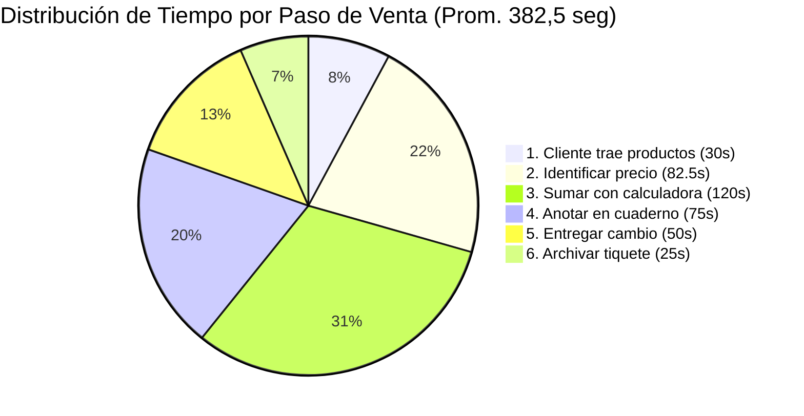
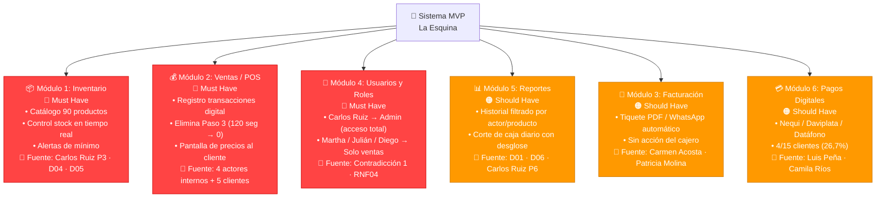
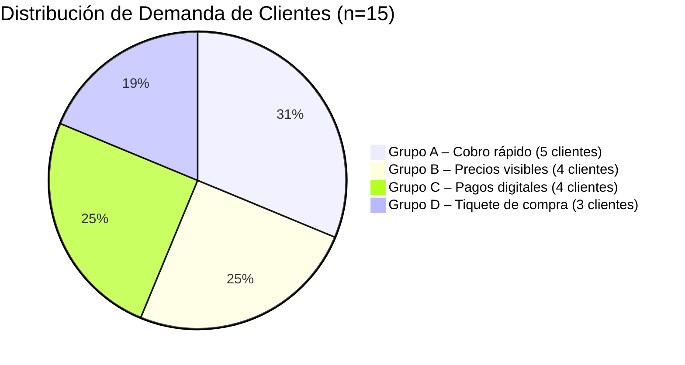
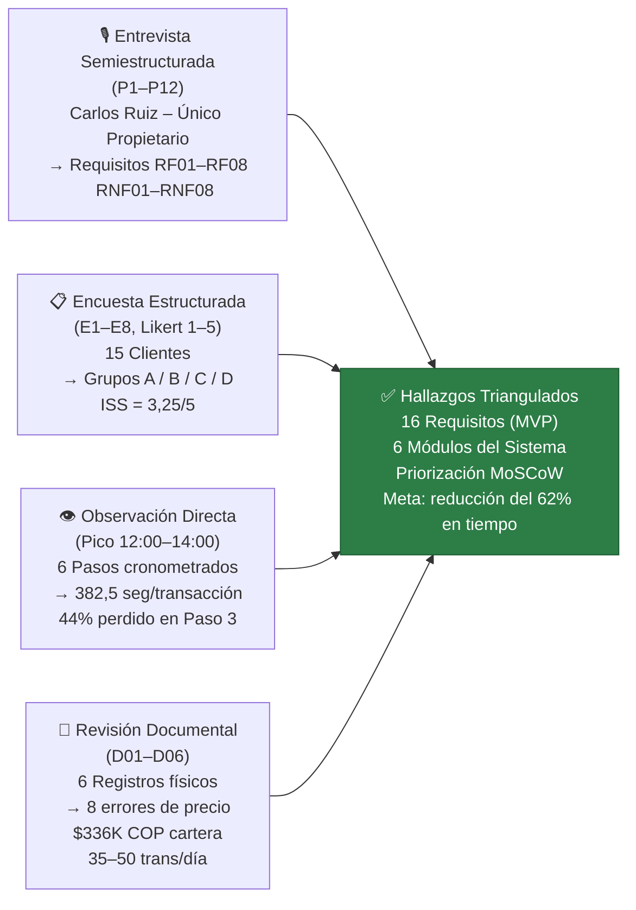

# Reporte Ejecutivo – Supermercado "La Esquina" | SENA 2025

---

# 📊 Resumen de `Lab_Analisis_v3.xlsx`
### *Laboratorio de Análisis de Datos – Datos Crudos, Estadísticas y Priorización de Requisitos*

---

## Visión General Ejecutiva

El libro de Excel constituye el **eje cuantitativo** del laboratorio de análisis para el Supermercado "La Esquina", un negocio familiar completamente manual estudiado por el programa de Análisis y Desarrollo de Software del SENA (Competencia 220501046, 2025). Consolida datos recolectados de 19 actores — 1 propietario, 3 empleados y 15 clientes — en seis hojas que cubren datos crudos, tablas de frecuencias, estadísticas operativas, datos para gráficas y la especificación completa de requisitos con modelo MoSCoW.

El hallazgo central del libro es contundente: el proceso de venta manual actual demanda un promedio de **382,5 segundos por transacción**, y el 44% de ese tiempo (120 segundos) se pierde exclusivamente en la suma manual con calculadora (Paso 3). El sistema POS digital es la necesidad más citada, mencionada por **9 de 19 actores (47,4%)**. Seis registros físicos (D01–D06) confirman deficiencias sistémicas en precios, inventario, cartera y gestión de caja.

El documento culmina en una **especificación MVP de 16 requisitos** (8 funcionales + 8 no funcionales), rigurosamente priorizados mediante el modelo MoSCoW y el estándar NTC-ISO/IEC 25010, identificando 7 requisitos Must Have con puntaje de prioridad ≥ 7 en la matriz de Importancia × Urgencia.

---

## Hallazgos e Insights Clave

- **El POS / Cobro Rápido lidera toda la demanda (RF01 – Must Have):** Con 9 de 19 actores (47,4%) solicitando explícitamente un cobro más ágil, este es el requisito de mayor prioridad. La ficha de observación confirma que el Paso 3 (sumar precios con calculadora) promedia 120 segundos y presenta nivel de error "Alto". Carlos Ruiz, Martha Suárez, Julián Torres y Diego Morales lo señalan desde adentro; cinco clientes (Ana Moreno, Sofía Mendoza, Gloria Castillo, Hernán Ospina, Ricardo Leal) reportaron tiempos de espera inaceptables desde afuera. Eliminar el Paso 3 proyecta una reducción del **62% en el ciclo de atención** — de 382 segundos a ~145 segundos — recuperando aproximadamente **3,7 horas de trabajo productivo al día** en 53 transacciones diarias.

- **La precisión de precios es el segundo punto de dolor (RF02 – Must Have):** El documento D04 (lista de precios en hoja suelta) evidencia que **8 de 90 productos (≈9%)** tienen discrepancias entre el cuaderno y las estanterías. Esto generó quejas confirmadas de Rosa Vargas (le cobraron el aceite más caro), Felipe Salcedo (observó diferencia de precios) e Iván Guerrero (solicitó pantalla de precios). Diego Morales también reportó el error durante su turno. Un catálogo digital de productos (RF02) resuelve directamente esta situación.

- **El Índice de Satisfacción (ISS) de velocidad de atención está por debajo del umbral aceptable:** Solo 4 de 15 clientes respondieron el ítem de calificación de velocidad (E2). El promedio ponderado es **3,25 / 5,0**, por debajo del piso aceptable de ≥ 4,0. Ningún cliente otorgó 5/5; el 50% calificó en 3 o menos (neutral/insatisfecho). Esta señal cuantitativa refuerza la urgencia del RF01.

- **La carga operativa está fuertemente concentrada en el propietario:** Carlos Ruiz atiende aproximadamente **40 de 57 transacciones diarias (70,2%)**, operando de 7am a 7pm como cajero principal y único decisor. Martha Suárez (~12%), Julián Torres (~10%) y Diego Morales (~7%) cubren el resto. El sistema debe diseñarse para soportar mínimo **53 transacciones/día** (promedio de 42,5 + buffer del 25%).

- **La cartera de crédito sin control representa un riesgo financiero real (RF05 – Should Have):** El documento D02 registra **12 clientes activos con fiado**, con un saldo promedio de $28.000 COP, totalizando **$336.000 COP en cartera activa** — gestionada únicamente en un cuaderno manual sin columna de abonos.

- **Los requisitos no funcionales son tan críticos como los funcionales:** Cuatro requisitos no funcionales son clasificados Must Have: (RNF01) interfaz intuitiva aprendible en ≤ 2 horas (Carlos Ruiz expresó resistencia moderada a la tecnología); (RNF02) modo offline obligatorio (la conectividad es residencial básica con caídas ocasionales); (RNF04) control de acceso por roles (Carlos debe ser el único usuario con visibilidad total de ventas); y (RNF05) compatibilidad con hardware de bajo costo (Android ≥ 8.0 o Windows 10, mín. 2 GB RAM).

- **Los pagos digitales son Should Have, no un bloqueador crítico:** Cuatro de 15 clientes (26,7%) — Luis Peña, Camila Ríos, Ricardo Leal y Andrés Quintero — quieren pagar con Nequi, Daviplata o tarjeta. Dos (Luis y Camila) afirmaron que se van sin comprar cuando no hay opción digital. Sin embargo, dado el presupuesto limitado de Carlos Ruiz (P12), esto se clasifica como **Should Have** y no como requisito crítico del MVP.

---

## Análisis de Datos y Visualizaciones

### Tabla 1 – Frecuencia de Requisitos por Grupo de Actores (Hoja T1)

| Funcionalidad / Mejora | Actores Internos | Clientes | Total Menciones | % del Total (n=19) | MoSCoW |
|---|---|---|---|---|---|
| POS – Cobro rápido / registro de venta | 4 | 5 | **9** | **47,4%** | 🔴 Must Have |
| Precios visibles y claros al cliente | 1 | 4 | **5** | **26,3%** | 🔴 Must Have |
| Control de inventario + alertas stock | 2 | 0 | **2** | **10,5%** | 🔴 Must Have |
| Pagos digitales (Nequi/Daviplata/tarjeta) | 0 | 4 | **4** | **21,1%** | 🟠 Should Have |
| Tiquete / factura de compra | 0 | 2 | **2** | **10,5%** | 🟠 Should Have |
| Gestión de crédito / fiado | 1 | 0 | **1** | **5,3%** | 🟠 Should Have |
| **TOTAL** | | | **23** | **100%** | |

> ⚠️ Nota: El total de menciones (23) supera los 19 actores porque algunos citaron múltiples necesidades.

---

### Tabla 2 – Tiempos del Proceso de Venta por Paso (Hoja T2 – Observación Directa)

| Paso | Mín (seg) | Máx (seg) | Prom (seg) | % del Total | Nivel de Error |
|---|---|---|---|---|---|
| 1. Cliente trae productos | 30 | 30 | 30 | 7,8% | Bajo |
| 2. Identificar precio (cuaderno/memoria) | 60 | 105 | 82,5 | 21,6% | ⚠️ Alto |
| 3. Sumar precios con calculadora | 90 | 150 | **120** | **31,4%** | ⚠️ Alto |
| 4. Anotar venta en cuaderno | 60 | 90 | 75 | 19,6% | Medio |
| 5. Calcular y entregar cambio | 40 | 60 | 50 | 13,1% | Medio |
| 6. Archivar tiquete/recibo | 20 | 30 | 25 | 6,5% | Bajo |
| **TOTAL** | | | **382,5** | **100%** | |

---

### Gráfica 1 – Distribución del Tiempo por Paso (Mermaid – Gráfico de Pastel)



---

### Gráfica 2 – Matriz de Priorización MoSCoW (Mermaid – Cuadrante)

```mermaid
quadrantChart
    title Matriz de Priorización: Importancia vs. Urgencia
    x-axis Baja Urgencia --> Alta Urgencia
    y-axis Baja Importancia --> Alta Importancia
    quadrant-1 Must Have
    quadrant-2 Should Have (Alta Importancia)
    quadrant-3 Could Have
    quadrant-4 Should Have (Alta Urgencia)
    RF01 POS Registro Venta: [0.95, 0.95]
    RF02 Catálogo Productos: [0.95, 0.95]
    RNF01 Interfaz Intuitiva: [0.95, 0.95]
    RNF02 Modo Offline: [0.95, 0.95]
    RNF04 Control Acceso Roles: [0.60, 0.95]
    RF03 Control Inventario: [0.60, 0.95]
    RNF05 Hardware Bajo Costo: [0.60, 0.95]
    RF04 Corte de Caja: [0.95, 0.65]
    RF05 Gestión Fiado: [0.60, 0.65]
    RF06 Tiquete Venta: [0.60, 0.65]
    RNF03 Tiempo Respuesta: [0.60, 0.65]
    RNF06 Actualiz. Catálogo: [0.60, 0.65]
    RNF08 Backup Automático: [0.60, 0.65]
    RF07 Historial Ventas: [0.30, 0.65]
    RF08 Gestión Proveedores: [0.15, 0.30]
    RNF07 Escalabilidad 300: [0.15, 0.30]
```

---

### Tabla 3 – Especificación Completa de Requisitos MVP (Hojas T5 y T6)

| ID | Nombre | Tipo | Prioridad (I×U) | MoSCoW | Módulo |
|---|---|---|---|---|---|
| RF01 | POS – Registro de Venta | Funcional | 9 | 🔴 Must Have | Ventas |
| RF02 | Catálogo de Productos (90 ítems) | Funcional | 9 | 🔴 Must Have | Inventario |
| RF03 | Control de Inventario + Alertas | Funcional | 6 | 🟠 Should Have | Inventario |
| RF04 | Corte de Caja Diario | Funcional | 6 | 🟠 Should Have | Reportes |
| RF05 | Gestión de Crédito / Fiado | Funcional | 4 | 🟠 Should Have | Clientes |
| RF06 | Tiquete de Venta (PDF/WhatsApp) | Funcional | 4 | 🟠 Should Have | Ventas |
| RF07 | Historial de Ventas con Filtros | Funcional | 2 | 🟡 Could Have | Reportes |
| RF08 | Gestión de Proveedores | Funcional | 1 | 🟡 Could Have | Proveedores |
| RNF01 | Interfaz Intuitiva (≤ 2h inducción) | No Funcional | 9 | 🔴 Must Have | Usabilidad |
| RNF02 | Modo Offline Obligatorio | No Funcional | 9 | 🔴 Must Have | Disponibilidad |
| RNF04 | Control de Acceso por Roles | No Funcional | 6 | 🔴 Must Have | Seguridad |
| RNF05 | Compatible Hardware Bajo Costo | No Funcional | 6 | 🔴 Must Have | Portabilidad |
| RNF03 | Tiempo de Respuesta ≤ 3 seg | No Funcional | 4 | 🟠 Should Have | Rendimiento |
| RNF06 | Actualización Catálogo sin Técnico | No Funcional | 4 | 🟠 Should Have | Mantenibilidad |
| RNF08 | Backup Automático Diario | No Funcional | 4 | 🟠 Should Have | Confiabilidad |
| RNF07 | Escalabilidad a 300 Productos | No Funcional | 1 | 🟡 Could Have | Escalabilidad |

**Totales:** 3 RF Must Have · 3 RF Should Have · 2 RF Could Have · 4 RNF Must Have · 4 RNF Should/Could Have = **16 requisitos en total**

---
---

# 📝 Resumen de `Analisis_Cualitativo_v3.docx`
### *Análisis Cualitativo de Datos Recolectados – Tarea 4 (T4), Módulo 2, SENA – Abril 2026*

---

## Visión General Ejecutiva

Este documento Word presenta el **análisis cualitativo** del mismo conjunto de 19 actores estudiado en el Supermercado "La Esquina", funcionando como el complemento interpretativo y narrativo del libro de Excel cuantitativo. Producido como Tarea 4 (T4) del programa Análisis y Desarrollo de Software del SENA (Competencia 220501046, Ficha 3413974, Abril 2026), aplica triangulación metodológica — combinando entrevista semiestructurada, encuesta estructurada, observación directa y revisión documental — para extraer, categorizar e interpretar las necesidades de los actores en módulos de software accionables.

El documento organiza sus hallazgos en torno a **seis módulos del sistema propuestos**, derivados de la agrupación categórica de las ideas expresadas por los 19 actores. Identifica cuatro contradicciones internas entre partes interesadas y las resuelve con decisiones de diseño concretas. Su conclusión central es que los módulos de Ventas/POS e Inventario son los más críticos (Must Have), ya que juntos abordan el 47,4% de todas las demandas de los actores y reducirían el tiempo de atención por transacción en un 62% estimado.

El análisis cualitativo aporta profundidad que la hoja de cálculo sola no puede proveer: citas textuales de actores, análisis de contradicciones entre partes interesadas, justificación narrativa a nivel de módulo y una diferenciación matizada entre el propietario (único decisor) y los tres empleados (usuarios operativos sin autoridad).

---

## Hallazgos e Insights Clave

- **La triangulación metodológica garantiza alta validez de los datos:** Se aplicaron cuatro instrumentos complementarios — (1) entrevista semiestructurada de 12 preguntas (P1–P12) únicamente con Carlos Ruiz, como único propietario y decisor; (2) encuesta estructurada de 8 ítems (E1–E8, escala Likert 1–5) con los 15 clientes; (3) ficha de observación directa que registra 6 pasos de la transacción en horario pico (12:00–14:00); y (4) revisión de 6 registros físicos (D01–D06). Esta triangulación reduce significativamente el riesgo de sesgo de fuente única y fundamenta cada requisito en al menos dos fuentes independientes.

- **Diferenciación crítica entre propietario y empleados:** El documento enfatiza de forma consistente y explícita que Carlos Ruiz es el **único propietario y el único tomador de decisiones**. Martha Suárez, Julián Torres y Diego Morales son empleados sin autoridad de decisión. Esta distinción determina directamente el diseño del control de acceso por roles: Carlos tiene acceso de Administrador (visibilidad total de ventas, edición de precios, gestión de crédito), mientras los tres empleados quedan restringidos al registro de ventas y consulta de inventario en modo lectura.

- **Cuatro contradicciones entre actores identificadas y resueltas por diseño:** El análisis va más allá de la recolección de datos para visibilizar tensiones operativas. (1) Carlos exige acceso exclusivo a los totales de ventas; los empleados necesitan visibilidad de su propio desempeño — resuelto con paneles diferenciados por rol (RNF04). (2) Carlos nunca ha emitido un tiquete; Carmen Acosta y Patricia Molina siempre lo exigen — resuelto con generación automática de tiquete PDF/WhatsApp al cerrar la venta (RF06), sin acción del cajero. (3) Martha y Julián son indiferentes a la facturación electrónica; Carlos y 3 clientes la requieren — resuelto automatizando la emisión dentro del flujo del POS (RF06). (4) Diego detectó errores de precio en D04 pero no tiene herramienta ni autorización para corregirlos — resuelto restringiendo la edición del catálogo al rol Administrador (RF02 + RNF04).

- **Las necesidades de los clientes se agrupan en cuatro segmentos con implicaciones de módulo distintas:** La muestra de 15 clientes no es homogénea. El Grupo A (Ana Moreno, Sofía Mendoza, Gloria Castillo, Hernán Ospina, Ricardo Leal — 5 clientes) prioriza el cobro rápido, confirmando el requisito del POS. El Grupo B (Rosa Vargas, Hernán Ospina, Felipe Salcedo, Iván Guerrero + Diego Morales — 4 clientes + 1 empleado) exige precios visibles y correctos, confirmando el catálogo. El Grupo C (Luis Peña, Camila Ríos, Ricardo Leal, Andrés Quintero — 4 clientes, 26,7%) requiere pagos digitales, clasificado como Should Have. El Grupo D (Carmen Acosta, Patricia Molina, Pedro Jiménez — 3 clientes, 20%) necesita tiquetes de compra, también Should Have.

- **Seis módulos del sistema derivados de la categorización cualitativa:** El documento eleva los hallazgos a una arquitectura modular: (1) Inventario — catálogo de 90 productos, control de stock en tiempo real, alertas de mínimo (Must Have); (2) Ventas/POS — cobro digital que elimina la suma manual (Must Have); (3) Facturación/Tiquetes — recibos PDF o WhatsApp automatizados (Should Have); (4) Usuarios y Roles — acceso diferenciado para 1 administrador + 3 empleados (Must Have, derivado implícitamente del análisis de contradicciones); (5) Reportes — corte de caja diario e historial filtrable por actor/producto/fecha (Should Have); (6) Pagos Digitales — integración con Nequi, Daviplata y datáfono (Should Have, 4/15 clientes).

- **La reducción del 62% en tiempo es la conclusión cuantificada más accionable del documento:** Al digitalizar el POS y el catálogo, los Pasos 2 y 3 del proceso observado (que juntos consumen 202,5 de 382,5 segundos, el 53% del tiempo total) quedan efectivamente eliminados. La proyección del documento — reducción de 382 segundos a aproximadamente 145 segundos por transacción — equivale a recuperar **3,7 horas de trabajo operativo al día** a un volumen de 53 transacciones, lo que hace el argumento de retorno de inversión del MVP excepcionalmente claro.

- **La muestra ampliada a 15 clientes revela grupos de demanda estadísticamente significativos invisibles en muestras pequeñas:** El documento señala explícitamente que la muestra ampliada (frente a un ejemplo de solo 5 clientes) permitió detectar tres grupos de demanda — pagos digitales (26,7%), tiquetes (20%) y precios visibles (26,7%) — con suficiente peso estadístico para justificar su inclusión en el backlog del MVP. Estos hallazgos están corroborados directamente por los documentos físicos D04 (errores de precios) y D02 (brecha en gestión de crédito).

---

## Análisis de Datos y Visualizaciones

### Gráfica 3 – Seis Módulos del Sistema Propuestos por Prioridad (Mermaid – Diagrama de Flujo)



---

### Tabla 4 – Contradicciones entre Actores y Resoluciones de Diseño

| Actores en Conflicto | Contradicción Detectada | Resolución de Diseño | Requisito |
|---|---|---|---|
| Carlos Ruiz vs. Martha / Julián / Diego | Carlos: "Solo yo debo ver las ventas totales." Los empleados necesitan ver su propio desempeño para mejorar. | Sistema de roles: empleados ven solo sus propias transacciones; Carlos ve el consolidado total. | RNF04 |
| Carlos Ruiz vs. Clientes (Carmen, Patricia) | Carlos nunca ha emitido un tiquete; ambas clientes siempre lo exigen para control del gasto familiar. | Tiquete digital automático (PDF/WhatsApp) generado al cerrar la venta — sin acción del cajero. | RF06 |
| Martha / Julián vs. Carlos / Clientes (E5) | Los empleados son indiferentes a la facturación electrónica; Carlos y 3 clientes la requieren. | La facturación se automatiza al cierre de la venta; Martha, Julián y Diego no necesitan intervenir. | RF06 |
| Diego Morales vs. D04 | Diego detectó precios incorrectos pero no tiene autorización ni herramienta para corregirlos. | Solo Carlos (Admin) puede editar precios en el catálogo; los empleados solo consultan. | RF02 + RNF04 |

---

### Gráfica 4 – Grupos de Demanda de Clientes (Mermaid – Gráfico de Pastel)



---

### Gráfica 5 – Mapa de Triangulación Metodológica (Mermaid – Diagrama de Flujo)



---

*Reporte generado a partir de: `Lab_Analisis_v3.xlsx` (datos cuantitativos) y `Analisis_Cualitativo_v3.docx` (análisis cualitativo)*
*Programa: Análisis y Desarrollo de Software – SENA | Competencia 220501046 | Ficha 3413974 | Abril 2026*
