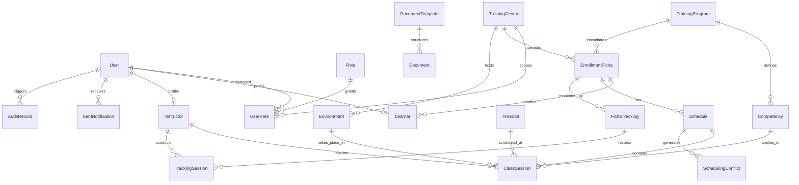

# Modelo de Datos Lógico Global — SENA Gestión de Horarios

> Fase: 03-Design | Agente: A10 | Estado: 🟢 Aprobado / Alineado con `sena-gestion-horarios`  
> Fecha: 2026-08-22  
> Prerequisitos: `docs/PROCESOS_BPMN.md` · `sql/schema.sql`  
>
> **Nota de alcance**: Este documento define el **modelo lógico global** del sistema real derivado de los 12 procesos BPMN y el mockup funcional. Integra entidades, atributos, restricciones, invariantes, políticas de retención y marcado de datos sensibles (PII).  
> **Regla de naming**: Entidades y atributos en **inglés, singular, ASCII** (`HALT-DB-NAMING`). Descripciones funcionales en español.

---

## Glosario — Lenguaje Ubicuo del Sistema

| Término (inglés) | Término (SENA / BPMN) | Definición en el Flujo Operativo |
|---|---|---|
| `TrainingCenter` | Centro de Formación | Sede operativa donde se ejecutan los programas y se asignan recursos. |
| `TrainingProgram` | Programa de Formación | Diseño curricular estructurado (Técnico, Tecnólogo, Operario, Auxiliar). |
| `Competency` | Competencia | Unidad formativa con código oficial SENA e intensidad horaria. |
| `EnrollmentFicha` | Ficha de Caracterización | Cohorte de aprendices asignada a un centro con fecha inicio/fin. |
| `Environment` | Ambiente de Formación | Aula, taller o laboratorio físico con capacidad y tipo. |
| `Instructor` | Instructor | Formador vinculado con límite de horas semanales y documento. |
| `Learner` | Aprendiz | Estudiante matriculado en una ficha con etapa lectiva o productiva. |
| `Schedule` | Horario de Ficha | Malla horaria de una ficha para un período lectivo específico. |
| `TimeSlot` | Franja Horaria | Bloque recurrente semanal (ej. Lunes 07:00–10:00). |
| `ClassSession` | Sesión de Clase | Evento de clase programado (Ficha + Competencia + Instructor + Ambiente + Franja). |
| `SchedulingConflict` | Conflicto de Horario | Cruce detectado (doble reserva de instructor, ambiente o franja). |
| `FichaTracking` | Seguimiento de Ficha | Tablero de control de riesgo pedagógico de la ficha. |
| `TrackingSession` | Sesión de Seguimiento | Registro periódico de asistencia y % de avance curricular. |
| `SentNotification` | Notificación Enviada | Aviso despachado (in-app / email) con enlace directo (deep link). |
| `Document` | Documento Oficial | Reporte o constancia generada mediante plantilla en object storage. |
| `AuditRecord` | Registro de Auditoría | Log inmutable de eventos y operaciones transaccionales. |

---

## Diagrama Entidad-Relación Global (Mermaid)

---

## Definición de Entidades por Bounded Context

### 1. Bounded Context: `iam-service`

#### `User`
Cuenta de acceso autenticable de cualquier persona que interactúa con la plataforma.

| Atributo | Tipo | Restricciones | PII |
|---|---|---|:---:|
| `id` | UUID | PK, DEFAULT `uuid_generate_v4()` | — |
| `email` | VARCHAR(255) | UNIQUE, NOT NULL | ✓ |
| `full_name` | VARCHAR(200) | NOT NULL | ✓ |
| `actor_type` | ENUM(`USER`, `INSTRUCTOR`, `LEARNER`) | NOT NULL | — |
| `is_active` | BOOLEAN | NOT NULL, DEFAULT true | — |
| `failed_attempts` | SMALLINT | NOT NULL, DEFAULT 0 | — |
| `locked_until` | TIMESTAMPTZ | NULLABLE | — |
| `created_at` | TIMESTAMPTZ | NOT NULL, DEFAULT `NOW()` | — |
| `updated_at` | TIMESTAMPTZ | NOT NULL, DEFAULT `NOW()` | — |

#### `Role`
Catálogo de roles funcionales del sistema (RBAC).

| Atributo | Tipo | Restricciones |
|---|---|---|
| `id` | UUID | PK, DEFAULT `uuid_generate_v4()` |
| `name` | VARCHAR(50) | UNIQUE, NOT NULL (`SYSTEM_ADMIN`, `CENTER_DIRECTOR`, `COORDINATOR`, `INSTRUCTOR`, `LEARNER`, `ADMIN_STAFF`) |
| `display_name` | VARCHAR(100) | NOT NULL |
| `is_system_role` | BOOLEAN | NOT NULL, DEFAULT true |

#### `UserRole`
Asignación de roles a usuarios, con alcance territorial opcional por Centro de Formación.

| Atributo | Tipo | Restricciones |
|---|---|---|
| `id` | UUID | PK, DEFAULT `uuid_generate_v4()` |
| `user_id` | UUID | FK $\to$ `User.id` (ON DELETE CASCADE), NOT NULL |
| `role_id` | UUID | FK $\to$ `Role.id` (ON DELETE CASCADE), NOT NULL |
| `training_center_id` | UUID | FK $\to$ `TrainingCenter.id` (NULLABLE $\to$ alcance nacional) |
| `assigned_by` | UUID | FK $\to$ `User.id` |
| `expires_at` | TIMESTAMPTZ | NULLABLE |
| `created_at` | TIMESTAMPTZ | NOT NULL, DEFAULT `NOW()` |

---

### 2. Bounded Context: `reference-data-service`

#### `TrainingCenter`
Centro de formación oficial del SENA.

| Atributo | Tipo | Restricciones | PII |
|---|---|---|:---:|
| `id` | UUID | PK, DEFAULT `uuid_generate_v4()` | — |
| `center_code` | VARCHAR(10) | UNIQUE, NOT NULL (ej. `'9226'`) | — |
| `name` | VARCHAR(200) | NOT NULL | — |
| `address` | TEXT | NULLABLE | — |
| `phone` | VARCHAR(20) | NULLABLE | ✓ |
| `is_active` | BOOLEAN | NOT NULL, DEFAULT true | — |

---

### 3. Bounded Context: `academic-management-service`

#### `TrainingProgram`
Diseño curricular aprobado por la Dirección General del SENA.

| Atributo | Tipo | Restricciones |
|---|---|---|
| `id` | UUID | PK, DEFAULT `uuid_generate_v4()` |
| `program_code` | VARCHAR(20) | UNIQUE, NOT NULL (ej. `'233104'`) |
| `name` | VARCHAR(200) | NOT NULL |
| `training_level` | ENUM(`AUXILIARY`, `OPERATOR`, `TECHNICIAN`, `TECHNOLOGIST`) | NOT NULL |
| `total_hours` | INTEGER | NOT NULL |
| `version` | INTEGER | NOT NULL, DEFAULT 1 |
| `is_active` | BOOLEAN | NOT NULL, DEFAULT true |

#### `Competency`
Unidad de aprendizaje formativa que compone el diseño curricular.

| Atributo | Tipo | Restricciones |
|---|---|---|
| `id` | UUID | PK, DEFAULT `uuid_generate_v4()` |
| `program_id` | UUID | FK $\to$ `TrainingProgram.id` (ON DELETE CASCADE), NOT NULL |
| `sena_code` | VARCHAR(20) | UNIQUE, NOT NULL |
| `name` | VARCHAR(300) | NOT NULL |
| `total_hours` | INTEGER | NOT NULL |
| `is_active` | BOOLEAN | NOT NULL, DEFAULT true |

#### `EnrollmentFicha`
Instancia operativa de un programa en un centro para una cohorte específica.

| Atributo | Tipo | Restricciones |
|---|---|---|
| `id` | UUID | PK, DEFAULT `uuid_generate_v4()` |
| `program_id` | UUID | FK $\to$ `TrainingProgram.id`, NOT NULL |
| `training_center_id` | UUID | FK $\to$ `TrainingCenter.id`, NOT NULL |
| `ficha_number` | VARCHAR(20) | UNIQUE, NOT NULL (ej. `'2670182'`) |
| `start_date` | DATE | NOT NULL |
| `expected_end_date` | DATE | NOT NULL |
| `learner_count` | INTEGER | NOT NULL |
| `status` | ENUM(`INDUCTION`, `EXECUTION`, `PRODUCTIVE_STAGE`, `COMPLETED`, `CANCELLED`) | NOT NULL |
| `created_at` | TIMESTAMPTZ | NOT NULL, DEFAULT `NOW()` |

> **Retención legal**: `EnrollmentFicha` se conserva **10 años** post-estado `COMPLETED` conforme a la normativa SENA.

---

### 4. Bounded Context: `training-environment-service`

#### `Environment`
Espacio físico (aula, taller, laboratorio) donde se imparten las clases.

| Atributo | Tipo | Restricciones |
|---|---|---|
| `id` | UUID | PK, DEFAULT `uuid_generate_v4()` |
| `training_center_id` | UUID | FK $\to$ `TrainingCenter.id`, NOT NULL |
| `name` | VARCHAR(100) | NOT NULL (ej. `'Laboratorio 402'`) |
| `environment_type` | ENUM(`CLASSROOM`, `LAB`, `WORKSHOP`, `AUDITORIUM`) | NOT NULL |
| `capacity` | INTEGER | NOT NULL |
| `location` | VARCHAR(200) | NULLABLE |
| `is_active` | BOOLEAN | NOT NULL, DEFAULT true |

---

### 5. Bounded Context: `actors-service`

#### `Instructor`
Perfil del formador vinculado a un centro.

| Atributo | Tipo | Restricciones | PII |
|---|---|---|:---:|
| `id` | UUID | PK, DEFAULT `uuid_generate_v4()` | — |
| `user_id` | UUID | UNIQUE, FK $\to$ `User.id` (ON DELETE CASCADE), NOT NULL | — |
| `document_type` | VARCHAR(10) | NOT NULL (`CC`, `CE`, `PEP`) | ✓ |
| `document_number` | VARCHAR(20) | UNIQUE, NOT NULL | ✓ |
| `full_name` | VARCHAR(200) | NOT NULL | ✓ |
| `email` | VARCHAR(255) | NOT NULL | ✓ |
| `phone` | VARCHAR(20) | NULLABLE | ✓ |
| `max_hours_per_week` | DECIMAL(4,1) | DEFAULT 40.0 | — |
| `is_active` | BOOLEAN | NOT NULL, DEFAULT true | — |

#### `Learner`
Perfil del aprendiz matriculado.

| Atributo | Tipo | Restricciones | PII |
|---|---|---|:---:|
| `id` | UUID | PK, DEFAULT `uuid_generate_v4()` | — |
| `user_id` | UUID | UNIQUE, FK $\to$ `User.id` (ON DELETE CASCADE), NOT NULL | — |
| `document_type` | VARCHAR(10) | NOT NULL | ✓ |
| `document_number` | VARCHAR(20) | UNIQUE, NOT NULL | ✓ |
| `full_name` | VARCHAR(200) | NOT NULL | ✓ |
| `email` | VARCHAR(255) | NOT NULL | ✓ |
| `ficha_id` | UUID | FK $\to$ `EnrollmentFicha.id` (ON DELETE CASCADE), NOT NULL | — |
| `enrollment_status` | ENUM(`ACTIVE`, `DROPOUT`, `TRANSFERRED`, `COMPLETED`) | NOT NULL | — |
| `current_stage` | ENUM(`LECTURE`, `PRODUCTIVE`) | NOT NULL | — |

> **Retención PII**: Datos de identificación personal conservados hasta **5 años** tras la desvinculación (Ley 1581 de 2012).

---

### 6. Bounded Context: `scheduling-service`

#### `Schedule`
Agregado raíz que consolida la malla horaria de una ficha.

| Atributo | Tipo | Restricciones |
|---|---|---|
| `id` | UUID | PK, DEFAULT `uuid_generate_v4()` |
| `ficha_id` | UUID | FK $\to$ `EnrollmentFicha.id` (ON DELETE CASCADE), NOT NULL |
| `name` | VARCHAR(200) | NOT NULL (ej. `'Horario 2026-1 ADSO 2670182'`) |
| `period` | VARCHAR(20) | NOT NULL (ej. `'2026-Q1'`) |
| `status` | ENUM(`DRAFT`, `UNDER_REVIEW`, `PUBLISHED`, `ARCHIVED`) | NOT NULL, DEFAULT `'DRAFT'` |
| `published_at` | TIMESTAMPTZ | NULLABLE |
| `published_by` | UUID | FK $\to$ `User.id`, NULLABLE |
| `created_by` | UUID | FK $\to$ `User.id`, NOT NULL |
| `created_at` | TIMESTAMPTZ | NOT NULL, DEFAULT `NOW()` |

> **Invariante de Dominio**: Al pasar a estado `PUBLISHED`, el registro y sus `ClassSession` asociadas quedan **congelados (inmutables)**. Cualquier modificación exige generar una nueva versión en `DRAFT`.

#### `TimeSlot`
Franja horaria estándar recurrente.

| Atributo | Tipo | Restricciones |
|---|---|---|
| `id` | UUID | PK, DEFAULT `uuid_generate_v4()` |
| `day_of_week` | SMALLINT | NOT NULL, CHECK (`1` a `7` $\to$ Lunes a Domingo) |
| `start_time` | TIME | NOT NULL |
| `end_time` | TIME | NOT NULL |
| `name` | VARCHAR(50) | NOT NULL (ej. `'Mañana 1 (07:00 - 10:00)'`) |

#### `ClassSession`
Instancia puntual de clase asignada.

| Atributo | Tipo | Restricciones |
|---|---|---|
| `id` | UUID | PK, DEFAULT `uuid_generate_v4()` |
| `schedule_id` | UUID | FK $\to$ `Schedule.id` (ON DELETE CASCADE), NOT NULL |
| `competency_id` | UUID | FK $\to$ `Competency.id`, NOT NULL |
| `instructor_id` | UUID | FK $\to$ `Instructor.id`, NOT NULL |
| `environment_id` | UUID | FK $\to$ `Environment.id`, NOT NULL |
| `time_slot_id` | UUID | FK $\to$ `TimeSlot.id`, NOT NULL |
| `session_date` | DATE | NOT NULL |
| `notes` | TEXT | NULLABLE |
| `execution_status` | ENUM(`ACTIVE`, `CANCELLED`, `EXECUTED`, `NOT_EXECUTED`) | DEFAULT `'ACTIVE'` |

#### `SchedulingConflict`
Registro de choques y solapamientos detectados por el motor de validación.

| Atributo | Tipo | Restricciones |
|---|---|---|
| `id` | UUID | PK, DEFAULT `uuid_generate_v4()` |
| `schedule_id` | UUID | FK $\to$ `Schedule.id` (ON DELETE CASCADE), NOT NULL |
| `conflict_type` | ENUM(`INSTRUCTOR_DOUBLE_BOOKED`, `ENVIRONMENT_DOUBLE_BOOKED`, `SESSIONS_OVERLAP`) | NOT NULL |
| `description` | TEXT | NOT NULL |
| `severity` | ENUM(`LOW`, `MEDIUM`, `HIGH`, `CRITICAL`) | NOT NULL, DEFAULT `'HIGH'` |
| `blocks_publication` | BOOLEAN | NOT NULL, DEFAULT true |
| `is_resolved` | BOOLEAN | NOT NULL, DEFAULT false |
| `resolved_by` | UUID | FK $\to$ `User.id`, NULLABLE |
| `resolution_notes` | TEXT | NULLABLE |
| `detected_at` | TIMESTAMPTZ | NOT NULL, DEFAULT `NOW()` |

---

### 7. Bounded Context: `monitoring-service` & `notification-service`

#### `FichaTracking`
Estado consolidado de riesgo pedagógico de la cohorte.

| Atributo | Tipo | Restricciones |
|---|---|---|
| `id` | UUID | PK, DEFAULT `uuid_generate_v4()` |
| `ficha_id` | UUID | FK $\to$ `EnrollmentFicha.id` (ON DELETE CASCADE), NOT NULL |
| `assigned_instructor_id` | UUID | FK $\to$ `Instructor.id`, NULLABLE |
| `status` | ENUM(`ON_TRACK`, `AT_RISK`, `CRITICAL`) | NOT NULL |
| `last_updated_at` | TIMESTAMPTZ | NOT NULL, DEFAULT `NOW()` |

#### `TrackingSession`
Sesión de avance y control de asistencia ejecutada por el instructor.

| Atributo | Tipo | Restricciones |
|---|---|---|
| `id` | UUID | PK, DEFAULT `uuid_generate_v4()` |
| `ficha_tracking_id` | UUID | FK $\to$ `FichaTracking.id` (ON DELETE CASCADE), NOT NULL |
| `session_date` | DATE | NOT NULL |
| `instructor_id` | UUID | FK $\to$ `Instructor.id`, NOT NULL |
| `attendance_percentage` | DECIMAL(5,2) | NOT NULL |
| `progress_percentage` | DECIMAL(5,2) | NOT NULL |
| `notes` | TEXT | NULLABLE |
| `created_at` | TIMESTAMPTZ | NOT NULL, DEFAULT `NOW()` |

#### `SentNotification`
Despacho in-app y correo electrónico a los actores.

| Atributo | Tipo | Restricciones | PII |
|---|---|---|:---:|
| `id` | UUID | PK, DEFAULT `uuid_generate_v4()` | — |
| `recipient_id` | UUID | FK $\to$ `User.id` (ON DELETE CASCADE), NOT NULL | — |
| `recipient_email` | VARCHAR(255) | NOT NULL | ✓ |
| `subject` | VARCHAR(300) | NOT NULL | — |
| `channel` | ENUM(`EMAIL`, `IN_APP`) | NOT NULL, DEFAULT `'IN_APP'` | — |
| `deep_link` | VARCHAR(255) | NULLABLE | — |
| `is_read` | BOOLEAN | NOT NULL, DEFAULT false | — |
| `sent_at` | TIMESTAMPTZ | NOT NULL, DEFAULT `NOW()` | — |

---

### 8. Bounded Context: `document-service`

#### `DocumentTemplate`
Plantilla parametrizable para reportes y actas oficiales.

| Atributo | Tipo | Restricciones |
|---|---|---|
| `id` | UUID | PK, DEFAULT `uuid_generate_v4()` |
| `code` | VARCHAR(50) | UNIQUE, NOT NULL (ej. `'ACTA_INICIO'`, `'HORARIO_FICHA_PDF'`) |
| `name` | VARCHAR(200) | NOT NULL |
| `template_body` | TEXT | NOT NULL (Handlebars / HTML) |
| `version` | INTEGER | NOT NULL, DEFAULT 1 |
| `is_active` | BOOLEAN | NOT NULL, DEFAULT true |

#### `Document`
Registro de documento generado almacenado en Object Storage.

| Atributo | Tipo | Restricciones |
|---|---|---|
| `id` | UUID | PK, DEFAULT `uuid_generate_v4()` |
| `template_id` | UUID | FK $\to$ `DocumentTemplate.id`, NULLABLE |
| `title` | VARCHAR(300) | NOT NULL |
| `owner_service` | VARCHAR(50) | NOT NULL (ej. `'scheduling-service'`, `'monitoring-service'`) |
| `owner_entity_id` | UUID | NULLABLE |
| `storage_key` | VARCHAR(500) | NOT NULL (Ruta S3/GCS) |
| `created_by` | UUID | FK $\to$ `User.id`, NULLABLE |
| `created_at` | TIMESTAMPTZ | NOT NULL, DEFAULT `NOW()` |

---

### 9. Bounded Context: `audit-service`

#### `AuditRecord`
Trazabilidad inmutable de todas las acciones del sistema.

| Atributo | Tipo | Restricciones |
|---|---|---|
| `id` | UUID | PK, DEFAULT `uuid_generate_v4()` |
| `event_id` | UUID | UNIQUE, NOT NULL, DEFAULT `uuid_generate_v4()` |
| `event_type` | VARCHAR(100) | NOT NULL (ej. `'SCHEDULE_PUBLISHED'`, `'CONFLICT_RESOLVED'`) |
| `source_service` | VARCHAR(50) | NOT NULL |
| `actor_id` | UUID | FK $\to$ `User.id`, NULLABLE |
| `entity_type` | VARCHAR(50) | NULLABLE |
| `entity_id` | UUID | NULLABLE |
| `payload` | JSONB | NOT NULL |
| `recorded_at` | TIMESTAMPTZ | NOT NULL, DEFAULT `NOW()` |

> **Invariante Absoluta**: Tabla estrictamente **Append-Only (sólo `INSERT`)**. Retención de **7 años** por normativa de auditoría pública.

---

## Patrones de Consulta Críticos (SLA de Rendimiento)

| Consulta Operativa / BPMN | Contexto / Tabla | Frecuencia | SLA Objetivo | Índice Recomendado |
|---|---|---|---|---|
| **C2: Consulta Disponibilidad Ambientes** | `Environment` / `ClassSession` | Alta (en vivo) | $< 150 \text{ ms}$ | `(environment_id, session_date, time_slot_id)` |
| **C2: Consulta Disponibilidad Instructores** | `Instructor` / `ClassSession` | Alta (en vivo) | $< 150 \text{ ms}$ | `(instructor_id, session_date, time_slot_id)` |
| **A1: Consulta Horario Propio Aprendiz** | `Schedule` $\to$ `ClassSession` | Muy Alta | $< 100 \text{ ms}$ | `(schedule_id, session_date)` |
| **I1: Mi Horario y Registro de Ejecución** | `ClassSession` | Alta | $< 150 \text{ ms}$ | `(instructor_id, session_date, execution_status)` |
| **D1: Tablero de Riesgo y KPIs de Fichas** | `FichaTracking` | Media | $< 300 \text{ ms}$ | `(status, last_updated_at)` |
| **S2: Consulta de Trazabilidad y Logs** | `AuditRecord` | Media | $< 500 \text{ ms}$ | `(source_service, recorded_at)` + `GIN(payload)` |

---

## Checklist de Cumplimiento Técnico (A10)

- [x] **Nomenclatura**: Nombres de tablas y atributos en inglés singular ASCII (`User`, `ClassSession`, `EnrollmentFicha`).
- [x] **Cobertura Funcional**: Soporta integralmente los 12 procesos BPMN (Coordinador, Instructor, Aprendiz, Director, Soporte).
- [x] **Integridad Referencial**: Claves primarias `UUID`, llaves foráneas y acciones en cascada (`CASCADE` / `SET NULL`) verificadas.
- [x] **Invariantes de Dominio**: Inmutabilidad de `Schedule` en `PUBLISHED` y comportamiento Append-Only en `AuditRecord`.
- [x] **Protección de Datos (PII)**: Documentos de identidad, correos, nombres y teléfonos debidamente categorizados.
- [x] **Script DDL Verificado**: Alineado al 100% con `sql/schema.sql`.
